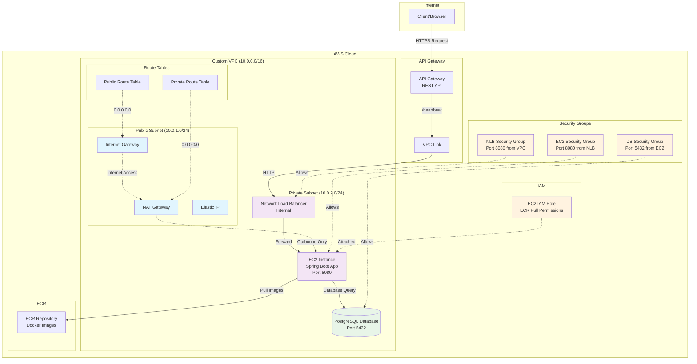

# Profile Board

Use IaC way to deploy a backend server on AWS EC2

## Architecture

The application is deployed on AWS using a secure, private VPC architecture with API Gateway for public access:



### Key Architecture Components:

- **API Gateway**: Provides public HTTPS endpoint (`/heartbeat`) with CORS support
- **VPC Link**: Securely connects API Gateway to private Network Load Balancer
- **Network Load Balancer**: Internal load balancer for high availability and health checks
- **EC2 Instance**: Runs Spring Boot application in private subnet (no public IP)
- **NAT Gateway**: Allows private subnet outbound internet access for Docker pulls
- **PostgreSQL RDS**: Database secured in private subnet, only accessible from EC2
- **ECR Repository**: Stores Docker images with proper IAM permissions
- **Security Groups**: Implement defense-in-depth with restrictive access rules

### Security Features:

- ✅ EC2 instance in private subnet (no direct internet access)
- ✅ Database isolated and only accessible from application
- ✅ Security groups with principle of least privilege
- ✅ IAM roles for service-to-service authentication
- ✅ HTTPS termination at API Gateway
- ✅ VPC Link for secure API Gateway integration

### Development

```bash
./gradlew ktlintFormat
```

```bash
./gradlew bootRun
```

```bash
auto/dev
```

```bash
docker build -t profile-board:latest .
```

```bash
docker run -p 8080:8080 profile-board:latest
```

## Kubernetes 部署

### 自动化部署脚本

使用 `auto/deploy-and-test.sh` 脚本可以一键部署应用到 Kubernetes 集群：

```bash
cd auto
./deploy-and-test.sh
```

该脚本会自动执行以下步骤：

1. 检查 kubectl 集群连接
2. 应用 Deployment 配置 (`k8s/development.yaml`)
3. 应用 Service 配置 (`k8s/service.yaml`)
4. 等待 Pod 就绪
5. 检查部署状态
6. 自动检测 K8s 环境类型（minikube/Docker Desktop）
7. 提供正确的访问 URL
8. 测试服务连通性

### 手动部署

如果需要手动部署，可以分步执行：

```bash
# 部署应用
kubectl apply -f k8s/development.yaml

# 创建服务
kubectl apply -f k8s/service.yaml

# 查看状态
kubectl get pods
kubectl get svc
kubectl logs <pod-name>
```

### 访问应用

部署完成后，根据你的 K8s 环境访问应用：

- **Minikube**: `http://<minikube-ip>:30080/heartbeat`
- **Docker Desktop**: `http://localhost:30080/heartbeat`
- **端口转发**:
  ```bash
  kubectl port-forward svc/profile-board-service 8080:8080
  # 然后访问 http://localhost:8080/heartbeat
  ```

## 推送镜像到 Docker Hub

1. 登录 Docker Hub：
   ```bash
   docker login
   ```
   按提示输入你的 Docker Hub 用户名和密码。

2. 给镜像打 tag（将 yourusername 替换为你的 Docker Hub 用户名）：
   ```bash
   docker tag profile-board:latest yourusername/profile-board:latest
   ```

3. 推送镜像到 Docker Hub：
   ```bash
   docker push yourusername/profile-board:latest
   ```

### Reference Documentation

For further reference, please consider the following sections:

* [Official Gradle documentation](https://docs.gradle.org)
* [Spring Boot Gradle Plugin Reference Guide](https://docs.spring.io/spring-boot/3.5.4/gradle-plugin)
* [Create an OCI image](https://docs.spring.io/spring-boot/3.5.4/gradle-plugin/packaging-oci-image.html)
* [Spring Data JPA](https://docs.spring.io/spring-boot/3.5.4/reference/data/sql.html#data.sql.jpa-and-spring-data)
* [Terraform](https://registry.terraform.io/providers/hashicorp/aws/latest/docs/resources/db_instance)

### Guides

The following guides illustrate how to use some features concretely:

* [Accessing Data with JPA](https://spring.io/guides/gs/accessing-data-jpa/)

### Additional Links

These additional references should also help you:

* [Gradle Build Scans – insights for your project's build](https://scans.gradle.com#gradle)
